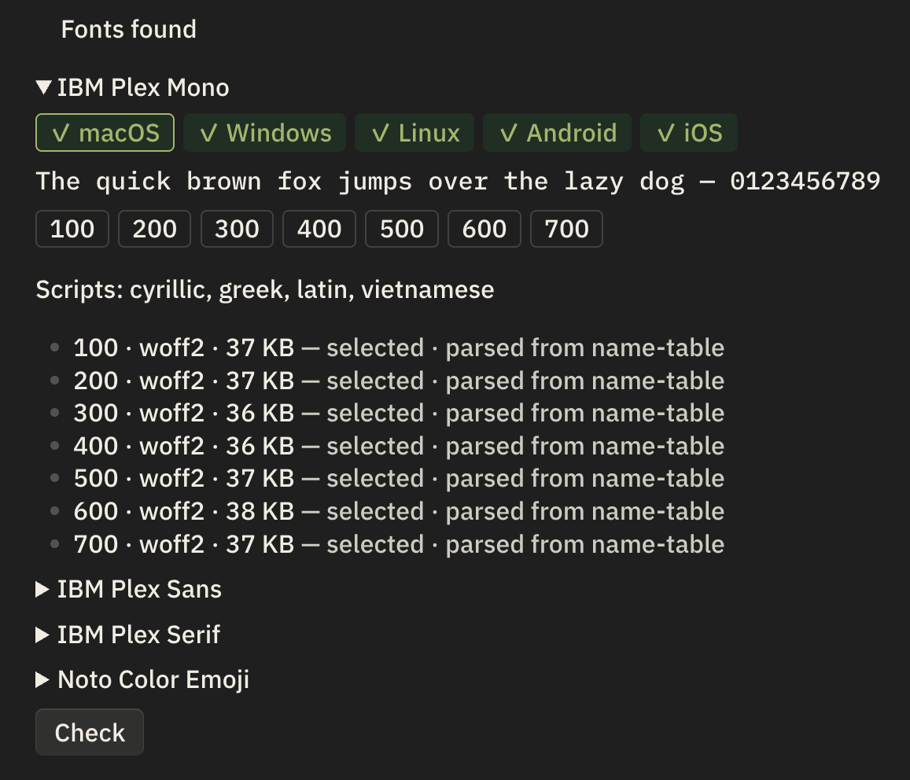

# Local Fonts

[](https://obsidian.md/plugins?id=local-fonts)
[](https://github.com/flowing-abyss/obsidian-local-fonts/actions/workflows/release.yml)
[](https://github.com/flowing-abyss/obsidian-local-fonts/releases)


Load fonts from a folder in your vault and apply them to text, interface, monospace,
headings and emoji. Works on desktop and mobile, and makes no network requests.

## How it works

Point the plugin at a folder and it reads every `.ttf`, `.otf`, `.woff` and `.woff2` file
inside, including subfolders. Family name, weight, style, script coverage and colour
format all come from the font file itself, so filenames are irrelevant in normal use.

Fonts load through resource URLs instead of base64, so the browser fetches only the
weights a note actually displays. A folder holding forty faces typically loads a dozen.

The folder can be hidden. `.fonts` is the default, which keeps a font collection out of
your note tree.

> [!WARNING]
> Obsidian Sync excludes hidden files and folders, and `.fonts` is one of them. Fonts kept
> there will not sync between devices. Either sync the folder some other way, or point this
> plugin at a folder that does not start with a dot. See
> [Hidden files and folders](https://obsidian.md/help/sync/settings#Hidden+files+and+folders)
> for details.

## Adding fonts

Create the folder next to `.obsidian` in your vault root and drop font files into it:

```
📂 My Vault
├── 📁 .obsidian/
└── 📂 .fonts/
    ├── 📁 IBM Plex Sans/
    │   ├── 🔤 Regular.woff2
    │   ├── 🔤 Regular.ttf
    │   └── 🔤 Bold.woff2
    ├── 📁 IBM Plex Mono/
    │   └── 🔤 Regular.otf
    └── 📁 Noto Color Emoji/
        ├── 😀 COLRv1.woff2
        └── 😀 SVG.woff2
```

Names are up to you, folders included. Faces are grouped by the family name read from each
file, so a flat folder works just as well as this one.

Then open Settings → Local Fonts. Families appear in the dropdowns after the folder is
scanned. Scanning runs in the background, and only files that changed since last time are
read again.

Filenames matter in one situation. When a `.woff2` cannot be decoded, the plugin looks
for a file with the same name and a different extension and reads metadata from that
instead. Keeping `foo.woff2` and `foo.ttf` named alike preserves that fallback.

You can keep the same face in several formats. The plugin picks one per platform,
preferring a format the current engine can render, then woff2 over woff over otf over
ttf, then the smaller file.

## Settings

**Fonts folder** takes a vault-relative path.

**Text**, **Interface**, **Monospace** and **Headings** each take a family from the fonts
you have, or leave the theme alone.

**Emoji** sits first in every font stack and covers only emoji code points, so it leaves
digits and punctuation to the family you chose for that role.

**Hard override** forces your fonts with `!important` for themes that set `font-family`
directly instead of using Obsidian's variables. Icon elements stay untouched.

## Diagnostics

Every family gets a card listing the weights it has, the scripts it covers, and the
operating systems that can render it. Each face shows its format, file size, colour
format, and whether the plugin selected it for this device. The sample line is drawn in
the family itself, and it loads only once you expand the card.



The **Check** button measures what actually rendered on the device you are using. Reach
for it after changing fonts, especially on a phone.

## Emoji formats

Colour emoji fonts come in incompatible flavours, and the two engines Obsidian runs on
cover different ones. Chromium, which powers desktop and Android, renders COLRv1 and
ignores OT-SVG. WebKit on iOS renders both.

One file often cannot serve every platform. Put more than one build of the same emoji
family in the folder and the plugin chooses per device. The card reports which build it
picked.

Google's Noto Color Emoji ships as a COLRv1 `.woff2`, an OT-SVG build, and a 25 MB `.ttf`
carrying both. Any combination of those works.

## Limitations

The test suite runs on every release against Obsidian 1.0.3 and the latest stable
release, covering Windows, macOS, Linux and Android on real devices. iOS has no
automation available, so the Check button is how you confirm a font applied there.

Emoji on iOS depend on which colour formats your files carry. When they fail, the card
shows which format is missing.

## Installation

Open Settings → Community plugins, browse for **Local Fonts**, then install and enable it.
You can also install it straight from
[the plugin page](https://obsidian.md/plugins?id=local-fonts).

To install a build by hand, download `main.js`, `manifest.json` and `styles.css` from the
[latest release](https://github.com/flowing-abyss/obsidian-local-fonts/releases), put them
in a `local-fonts` folder inside your vault's `.obsidian/plugins/` directory, and restart
Obsidian. [BRAT](https://github.com/TfTHacker/obsidian42-brat) does the same thing and
keeps it updated from this repository.

## License

[MIT](LICENSE)
