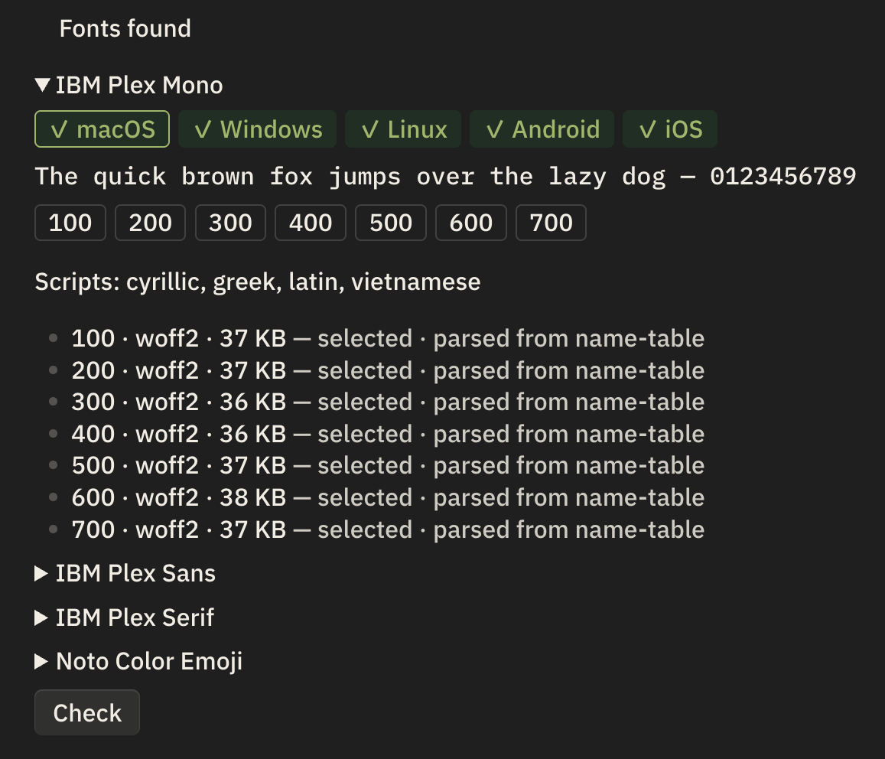

# Local Fonts

[](https://obsidian.md/plugins?id=local-fonts)
[](https://github.com/flowing-abyss/obsidian-local-fonts/actions/workflows/release.yml)
[](https://github.com/flowing-abyss/obsidian-local-fonts/releases)


Load fonts from a folder in your vault and apply them to text, interface, monospace,
headings and emoji. Works on desktop and mobile, and makes no network requests.

## How it works

Point the plugin at a folder and it reads every `.ttf`, `.otf`, `.woff` and `.woff2` file
inside, including subfolders. Family name, weight, style, script coverage and colour
format all come from the font file itself, so filenames are irrelevant in normal use.

Fonts load through resource URLs instead of base64, so the browser fetches only the
weights a note actually displays. A folder holding forty faces typically loads a dozen.

Variable fonts stay variable. A file carrying a weight axis is declared across its whole
range, so every weight your theme asks for is drawn from the real design. A single value
would leave the browser faking bold from one instance, which smears the outlines.

The default folder is `fonts` in your vault root. Any vault-relative path works, hidden
ones like `.fonts` included, which keeps a font collection out of your note tree.

> [!WARNING]
> Obsidian Sync excludes hidden files and folders, so anything under a folder whose name
> starts with a dot stays on the device it was added to. Sync that folder some other way,
> or keep the fonts somewhere visible. See
> [Hidden files and folders](https://obsidian.md/help/sync/settings#Hidden+files+and+folders)
> for details.

## Adding fonts

Create the folder next to `.obsidian` in your vault root and drop font files into it:

```
📂 My Vault
├── 📁 .obsidian/
└── 📂 fonts/
    ├── 📁 IBM Plex Sans/
    │   ├── 🔤 Regular.woff2
    │   ├── 🔤 Regular.ttf
    │   └── 🔤 Bold.woff2
    ├── 📁 IBM Plex Mono/
    │   └── 🔤 Regular.otf
    └── 📁 Noto Color Emoji/
        ├── 😀 COLRv1.woff2
        └── 😀 SVG.woff2
```

Names are up to you, folders included. Faces are grouped by the family name read from each
file, so a flat folder works just as well as this one.

Then open Settings → Local Fonts. Families appear in the dropdowns after the folder is
scanned. Scanning runs in the background, and only files that changed since last time are
read again. Opening these settings checks the folder too, so a font you just dropped in
shows up without restarting Obsidian.

Filenames matter in one situation. When a `.woff2` cannot be decoded, the plugin looks
for a file with the same name and a different extension and reads metadata from that
instead. Keeping `foo.woff2` and `foo.ttf` named alike preserves that fallback.

You can keep the same face in several formats. The plugin picks one per platform,
preferring a format the current engine can render, then woff2 over woff over otf over
ttf, then the smaller file.

## Settings

**Fonts folder** takes a vault-relative path.

**Text**, **Interface**, **Monospace** and **Headings** each take a family from the fonts
you have, or leave the theme alone. Assignments are independent: you can choose several
ordinary roles together, then add or clear Emoji without changing those choices. Unassigned
roles retain Obsidian's native font inheritance.

**Emoji** adds a colour font to standard native font paths throughout Obsidian, independently
of the other choices. Its face is limited to emoji code points, leaving ordinary letters,
digits and punctuation to the font chosen for each surface. Settings sync between devices;
the font files must also be present on each device.

In normal mode, a font set in Appearance or by a theme can take precedence over a plugin
choice. **Hard override** forces assigned fonts with `!important` on the corresponding
standard surfaces when a theme sets `font-family` directly. Icon elements stay untouched.

## Diagnostics

Every family gets a card listing the weights it has, the scripts it covers, and the
operating systems that can render it. Each face shows its format, file size, colour
format, and whether the plugin selected it for this device. The sample line is drawn in
the family itself, and it loads only once you expand the card.



The **Check** button asks the current device to load each assigned local font, then inspects
the requested font stacks of representative open views. It reports a load failure, an
unverified load, and whether another family precedes the selection. It cannot confirm
which font drew every character; glyph coverage and browser fallback still decide that.

The **Rescan** button re-reads every file in the folder from scratch. Change detection
normally compares each file's size and modification time, which is quick enough to run
whenever these settings open. One case slips past it, a font replaced in place by one of
exactly the same size and modification time, which restoring from a backup or copying
with timestamps preserved can produce. Press Rescan when a font changed on disk and the
card still describes the old one.

## Emoji formats

Colour emoji fonts come in incompatible flavours, and the two engines Obsidian runs on
cover different ones. Chromium, which powers desktop and Android, renders COLRv1 and
ignores OT-SVG. WebKit on iOS renders both.

One file often cannot serve every platform. Put more than one build of the same emoji
family in the folder and the plugin chooses per device. The card reports which build it
picked.

Google's Noto Color Emoji ships as a COLRv1 `.woff2`, an OT-SVG build, and a 25 MB `.ttf`
carrying both. Any combination of those works.

## Limitations

The desktop test matrix covers Obsidian 1.0.3 and the latest stable release on
Windows, macOS and Linux. Android tests drive the real app in an emulator, covering
Obsidian 1.8.10 and the latest stable release. iOS requires the
[real-device verification procedure](tests/manual/font-roles-ios.md); Check can
report loading and requested stack order, but final glyph rendering still needs
inspection on an iOS device.

Emoji on iOS depend on which colour formats your files carry. When they fail, the card
shows which format is missing.

## Installation

Open Settings → Community plugins, browse for **Local Fonts**, then install and enable it.
You can also install it straight from
[the plugin page](https://obsidian.md/plugins?id=local-fonts).

To install a build by hand, download `main.js`, `manifest.json` and `styles.css` from the
[latest release](https://github.com/flowing-abyss/obsidian-local-fonts/releases), put them
in a `local-fonts` folder inside your vault's `.obsidian/plugins/` directory, and restart
Obsidian. [BRAT](https://github.com/TfTHacker/obsidian42-brat) does the same thing and
keeps it updated from this repository.

## License

[MIT](LICENSE)
